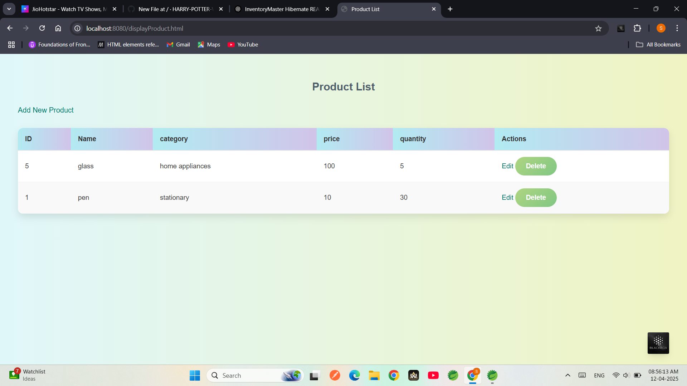
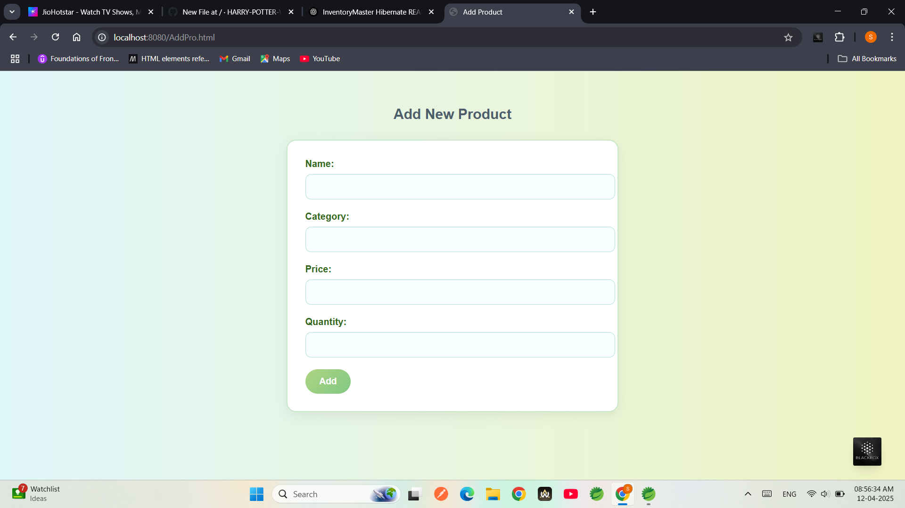
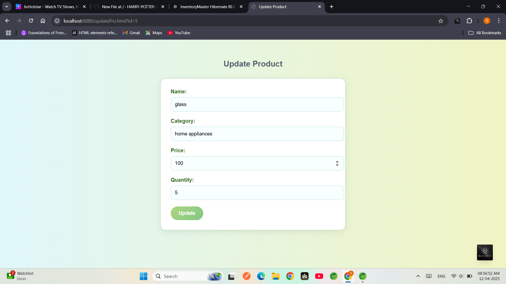
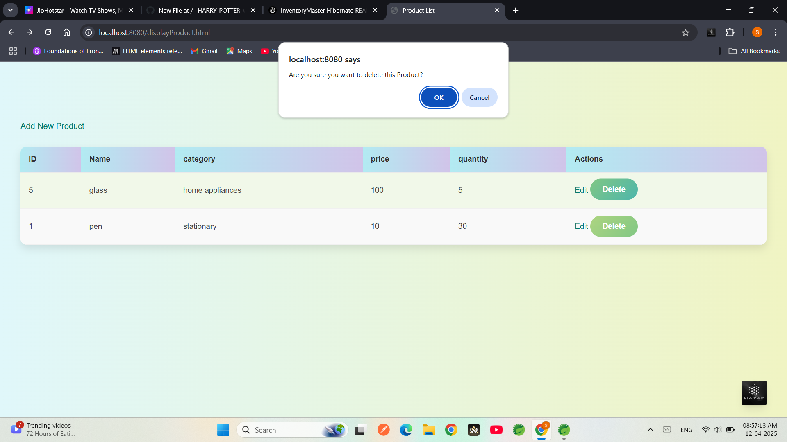

---

# InventoryMaster Hibernate

InventoryMaster is a Java-based desktop application built using **Html**, **Hibernate ORM**, and **Postgres**. It provides a basic inventory management system where users can add, update, delete, and manage product data efficiently.

## 🔧 Tech Stack

- **Html** – For GUI development  
- **Hibernate ORM** – For database operations  
- **Postgres** – Backend relational database  
- **Maven** – Dependency management  

## 📂 Project Structure

```
InventoryMaster_Hibernate/
│
├── src/
│   ├── com.inventory.hibernate/      # Hibernate configurations and DAO
│   ├── com.inventory.model/          # Model classes (e.g., Product)
│   └── com.inventory.controller/     # Servlet Controller class
│
├── hibernate.cfg.xml                 # Hibernate config file
├── pom.xml                           # Maven dependencies
└── README.md
```

## 🚀 Features

- Add new products with details like name, quantity, and price
- Update or delete existing products
- View a table of all stored products
- Hibernate handles all database CRUD operations

## 🛠️ Setup Instructions

1. **Clone the repository**
   ```bash
   git clone https://github.com/HARRY-POTTER-WIZARD/InventoryMaste_Hibernate.git
   cd InventoryMaste_Hibernate
   ```

2. **Configure Postgres Database**
   - Create a Postgres database (e.g., `inventorydb`)
   - Update `hibernate.cfg.xml` with your DB credentials:
     ```xml
     <property name="connection.url">jdbc:Postgres://localhost:3306/inventorydb</property>
     <property name="connection.username">your_username</property>
     <property name="connection.password">your_password</property>
     ```

3. **Build the project with Maven**
   ```bash
   mvn clean install
   ```

4. **Run the application**
   - Open `InventorySystem.java` or the main class containing `main()` method in your IDE and run the app.

## 📸 Screenshots
1. **Display Product**


2. **Add Product**

3. **Update Product**

4. **Delete Product**



## 🧑‍💻 Author

**[Swapnil Pradip Dande](https://github.com/HARRY-POTTER-WIZARD)**

---
